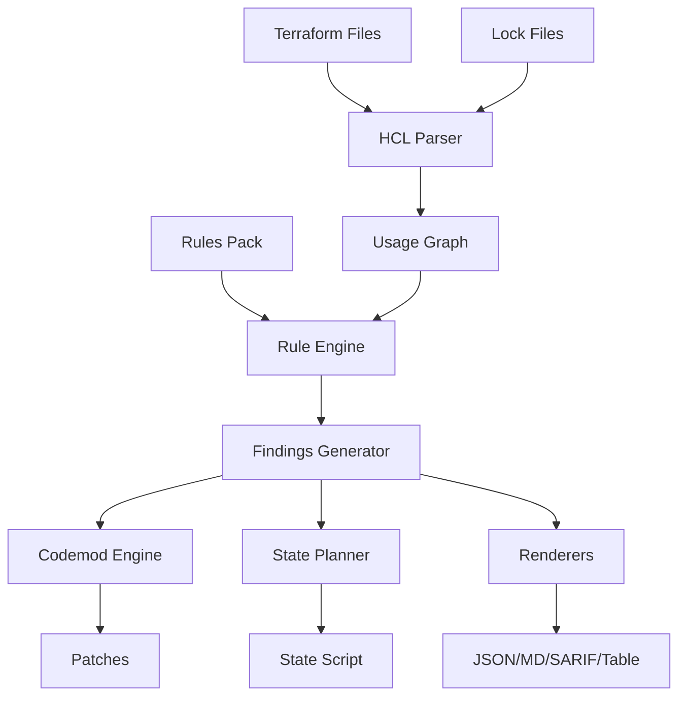

# Developer Architecture Guide

This document explains the analyzer’s internal architecture, data flow, and extension points for developers who want to understand, modify, or extend the system.

## System Overview

The analyzer is a Terraform upgrade intelligence CLI that follows a pipeline architecture:

```
HCL Files → Parser → Usage Graph → Rule Engine → Findings → Renderers → Output
     ↓           ↓         ↓           ↓          ↓         ↓
  Lockfiles   Modules   Providers   Rules Pack  Codemods  JSON/MD/SARIF
```

## Core Architecture

### 1. Data Flow Pipeline



### 2. Module Structure

```
cmd/terraform-mcp-analyzer/           - CLI entrypoint and command routing
internal/
├── hclparse/       - Terraform HCL parsing and lockfile ingestion
├── graph/          - Usage graph generation (modules/providers/resources)
├── rules/          - Rules engine, pack loader, signature verification
├── engine/         - Finding generation and rule matching
├── codemod/        - HCL AST transformations (patches)
├── stateplan/      - Terraform state migration planning
├── render/         - Output format renderers
├── policy/         - Policy enforcement and filtering
├── update/         - Pack downloading and caching
└── cache/          - Local pack caching
pkg/                - Public APIs (minimal)
tools/              - Standalone utilities (scraping, signing)
```

## Core Components Deep Dive

### HCL Parser (`internal/hclparse`)

**Purpose**: Parse Terraform files and extract usage information

**Key Types**:
```go
type UsageGraph struct {
    TerraformVersion string
    Providers        []ProviderUse
    Modules          []ModuleUse
    Resources        []ResourceUse  // Future extension
}

type ProviderUse struct {
    Name        string            // "hashicorp/aws"
    Constraint  string            // ">= 4.0.0"
    LockedVersion string          // From lockfile
    File        string
    Line, Col   int
}
```

**How it works**:
1. Uses `hashicorp/hcl/v2` to parse `.tf` files
2. Extracts `terraform`, `provider`, and `module` blocks
3. Cross-references with `.terraform.lock.hcl` for pinned versions
4. Builds normalized usage graph with source locations

**Extension points**:
- Add new block types (e.g., `data`, `resource`)
- Support additional file formats (`.tfvars`, `.tf.json`)
- Extract more metadata (tags, dependencies)

### Rules Engine (`internal/rules`)

**Purpose**: Load, validate, and manage upgrade rules

**Key Types**:
```go
type Rule struct {
    ID        string            `json:"id"`
    Ecosystem string            `json:"ecosystem"`
    Provider  string            `json:"provider,omitempty"`
    Module    string            `json:"module,omitempty"`
    From      string            `json:"from"`
    To        string            `json:"to"`
    Type      string            `json:"type"`
    Payload   map[string]any    `json:"payload,omitempty"`
    Fix       *FixAction        `json:"fix,omitempty"`
    State     *StateAction      `json:"state,omitempty"`
    Docs      []DocRef          `json:"docs,omitempty"`
    Meta      RuleMeta          `json:"meta"`
}
```

**Supported Rule Types**:
- `module_merged`: Module structure changes
- `var_renamed`: Variable name changes
- `var_removed`: Removed variables
- `provider_min_version`: Version constraints
- `state_move`: State operations needed
- `behavior_change`: Breaking behavior changes

**How it works**:
1. Streams JSONL rules from file/URL
2. Validates each rule against schema
3. Supports optional zstd compression
4. Verifies Ed25519/cosign signatures

**Extension points**:
- Add new rule types (see "Adding Rule Types" below)
- Implement custom pack formats
- Add rule inheritance/composition

### Engine (`internal/engine`)

**Purpose**: Match rules against usage graphs and generate findings

**Key Algorithm**:
```go
func Match(graph *UsageGraph, rules []Rule) []Finding {
    var findings []Finding
    
    for _, rule := range rules {
        for _, usage := range findMatchingUsage(graph, rule) {
            if inVersionRange(usage.Version, rule.From, rule.To) {
                finding := generateFinding(rule, usage)
                findings = append(findings, finding)
            }
        }
    }
    
    return deterministic_sort(findings)
}
```

**Matching Logic**:
1. For each rule, find matching providers/modules in usage graph
2. Check if current version falls in rule's `from` range
3. Check if target version falls in rule's `to` range
4. Generate finding with source location and metadata

**Extension points**:
- Custom matching algorithms
- Rule prioritization/scoring
- Conditional rule application

### Codemod Engine (`internal/codemod`)

**Purpose**: Generate HCL AST transformations for automated fixes

**Key Transformations**:
```go
type Transformation interface {
    Apply(file *hcl.File) (*hcl.File, error)
    Description() string
}

// Built-in transformations
- ReplaceModuleSource: Change module source paths
- RenameVariable: Rename module input variables
- UpdateProviderVersion: Modify version constraints
```

**How it works**:
1. Parse HCL into AST
2. Apply transformations based on rule fix actions
3. Generate unified diff patches
4. Preserve formatting and comments

**Extension points**:
- Add new transformation types
- Implement complex multi-file transforms
- Add validation/safety checks

### State Planner (`internal/stateplan`)

**Purpose**: Generate Terraform state migration scripts

**Key Operations**:
```go
type StateOp struct {
    Op   string `json:"op"`   // "mv" or "rm"
    Addr string `json:"addr"` // Resource address
}
```

**How it works**:
1. Collect state operations from rules
2. Sort operations for safe execution order
3. Generate shell script with proper error handling
4. Include rule references and documentation

**Extension points**:
- Add new operation types (`import`, `replace`)
- Implement dependency analysis
- Add rollback script generation

## Data Models

### Finding Structure
```go
type Finding struct {
    RuleID      string          `json:"rule_id"`
    RuleType    string          `json:"rule_type"`
    Module      string          `json:"module,omitempty"`
    Severity    string          `json:"severity"`
    File        string          `json:"file"`
    Line        int             `json:"line"`
    Col         int             `json:"col"`
    Message     string          `json:"message"`
    DocURL      string          `json:"doc_url,omitempty"`
    DocExcerpt  string          `json:"doc_excerpt,omitempty"`
    Suggestion  string          `json:"suggestion,omitempty"`
    Patch       *Patch          `json:"patch,omitempty"`
    State       []StateOp       `json:"state,omitempty"`
    Payload     map[string]any  `json:"payload,omitempty"`
}
```

### Pack Metadata
```go
type PackMeta struct {
    ID           string    `json:"pack_id"`
    Channel      string    `json:"channel"`
    SchemaVersion int      `json:"schema_version"`
    CreatedAt    string    `json:"created_at"`
    Sources      []string  `json:"sources"`
    Builder      string    `json:"builder"`
}
```

## Extension Guide

### Adding New Rule Types

1. **Define the rule type**:
```go
// In internal/rules/schema.go
const RuleTypeCustom = "custom_change"

type CustomPayload struct {
    CustomField string `json:"custom_field"`
}
```

2. **Add validation**:
```go
// In internal/rules/loader.go
func validateRule(r Rule) error {
    switch r.Type {
    case RuleTypeCustom:
        return validateCustomRule(r)
    // ...
    }
}
```

3. **Implement matching logic**:
```go
// In internal/engine/matcher.go
func matchRule(rule Rule, usage Usage) []Finding {
    switch rule.Type {
    case RuleTypeCustom:
        return matchCustomRule(rule, usage)
    // ...
    }
}
```

4. **Add transformation support**:
```go
// In internal/codemod/transforms.go
func NewCustomTransform(payload CustomPayload) Transformation {
    return &customTransform{payload: payload}
}
```

### Adding New Output Formats

1. **Create renderer**:
```go
// In internal/render/custom.go
func RenderCustom(findings []Finding, pack PackMeta) ([]byte, error) {
    // Implementation
}
```

2. **Register format**:
```go
// In pkg/cli/commands.go
formats := map[string]RenderFunc{
    "custom": render.RenderCustom,
}
```

### Adding New Provider Support

1. **Create test fixtures**:
```
testdata/providers/newprovider/
├── main.tf                    # Sample usage
├── .terraform.lock.hcl        # Version locks
└── expected_findings.json     # Expected results
```

2. **Create rules pack**:
```jsonl
{"id":"analyzer.newprovider.v1_to_v2.breaking.001","provider":"company/newprovider","from":">=1.0.0 <2.0.0","to":">=2.0.0","type":"provider_min_version","payload":{"min":"2.0.0"}}
```

3. **Add integration test**:
```go
// In internal/engine/engine_test.go
func TestNewProviderRules(t *testing.T) {
    // Test implementation
}
```

## Testing Strategy

### Unit Tests
- **Parser tests**: HCL parsing with various Terraform configurations
- **Rules tests**: Rule loading, validation, and matching
- **Engine tests**: Finding generation with golden file comparison
- **Transform tests**: Codemod generation and application

### Integration Tests
- **E2E scenarios**: Full pipeline testing with real Terraform configs
- **Multi-format output**: Verify all renderers produce correct output
- **Error handling**: Test invalid inputs and edge cases

### Golden Files
Golden file testing is used for deterministic output validation:
```
testdata/golden/
├── findings/
│   ├── aws_iam_v5_to_v6.json
│   └── azure_vm_v2_to_v3.json
├── patches/
│   ├── module_source_change.diff
│   └── variable_rename.diff
└── state/
    └── resource_moves.sh
```

## Performance Considerations

### Memory Usage
- Stream rules loading (don't load entire pack in memory)
- Lazy HCL parsing (parse files on demand)
- Efficient finding deduplication

### CPU Usage
- Parallel file processing
- Optimized rule matching algorithms
- Cached version constraint parsing

### Disk I/O
- Minimal file system operations during scan
- Efficient pack caching strategy
- Streaming output for large result sets

## Security Considerations

### Input Validation
- Validate all HCL input files
- Sanitize rule pack content
- Verify signature authenticity

### Offline Operation
- No network calls during scan phase
- Local-only rule evaluation
- Deterministic output generation

### Signature Verification
- Ed25519 signature support
- Cosign bundle compatibility
- Offline verification capability

## Debugging Tips

### Enable Verbose Logging
```bash
./bin/terraform-mcp-analyzer scan --verbose --pack rules.jsonl .
```

### Examine Intermediate Data
```bash
# Dump parsed usage graph
./bin/terraform-mcp-analyzer scan --debug-graph --pack rules.jsonl .

# Show rule matching details
./bin/terraform-mcp-analyzer scan --debug-matching --pack rules.jsonl .
```

### Test Rule Changes
```bash
# Validate new rules
./bin/terraform-mcp-analyzer verify --pack new_rules.jsonl

# Test against specific directory
./bin/terraform-mcp-analyzer scan --pack new_rules.jsonl testdata/scenarios/complex
```

## Contributing Workflow

1. **Study existing implementations** in similar modules
2. **Write tests first** with golden file expectations
3. **Implement incrementally** with frequent testing
4. **Update documentation** for public APIs
5. **Verify E2E scenarios** work with changes

## Next Steps

For practical examples of extending the analyzer, see:
- `docs/TESTING.md` - Comprehensive testing guide
- `docs/RULES_DEVELOPMENT.md` - Rules authoring workflow
- `docs/NEW_TERRAFORM_TESTING.md` - Adding new provider support
